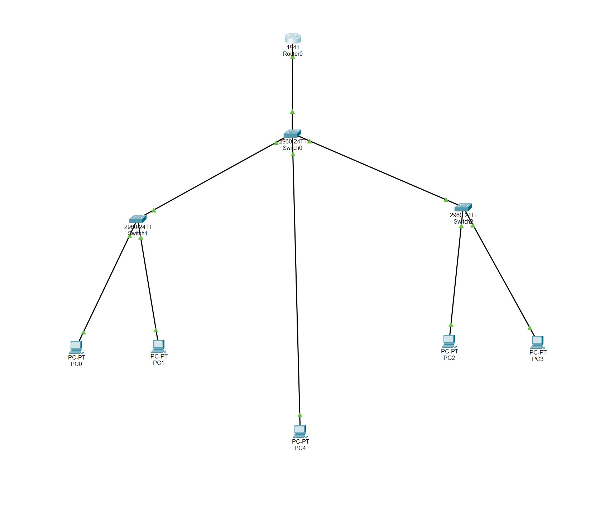
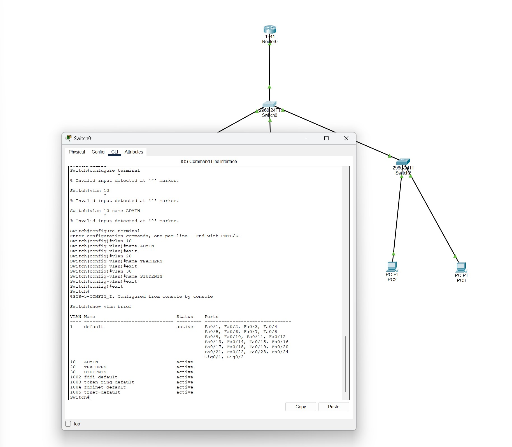
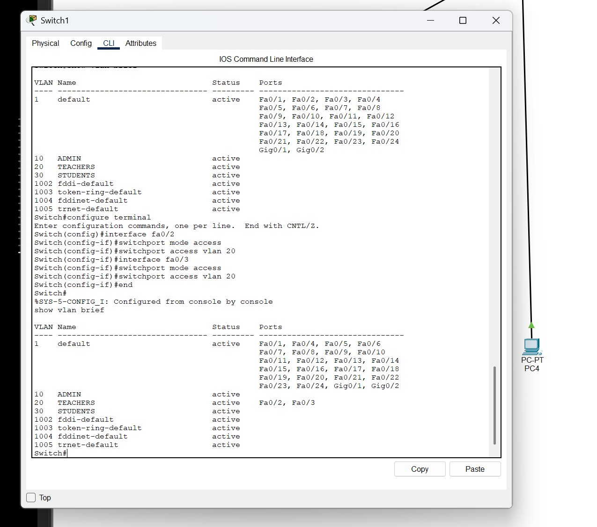
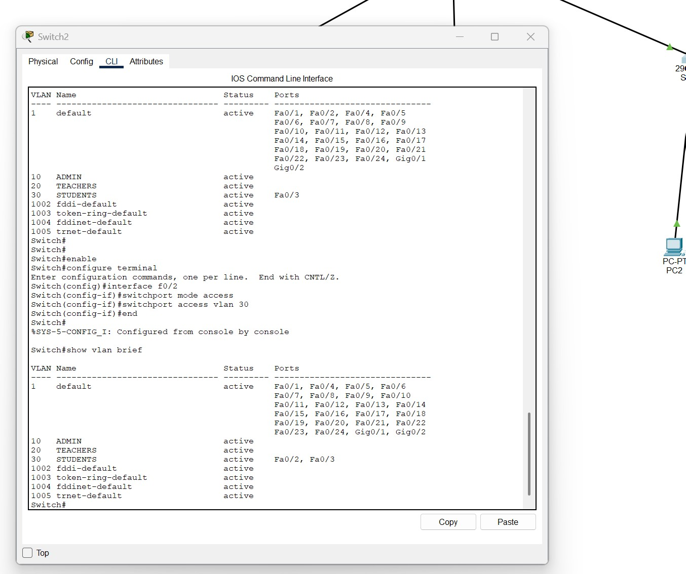
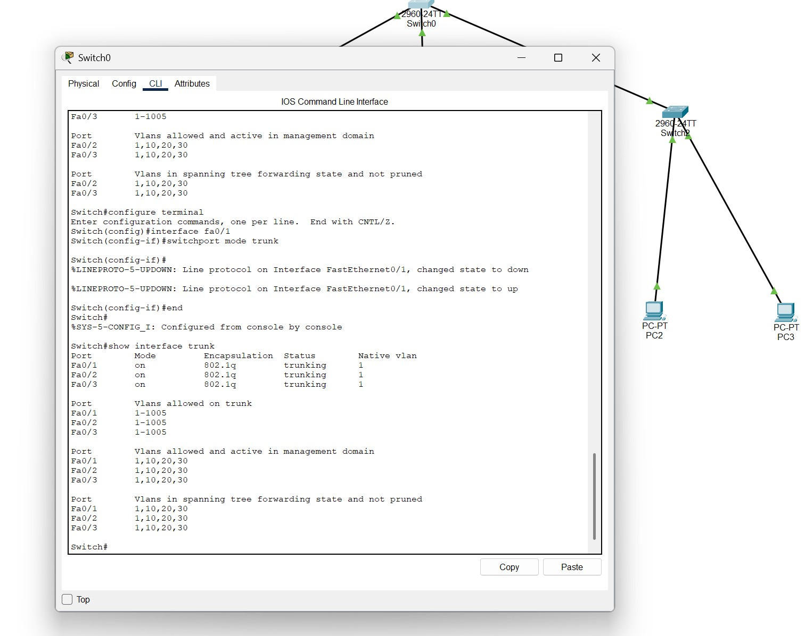
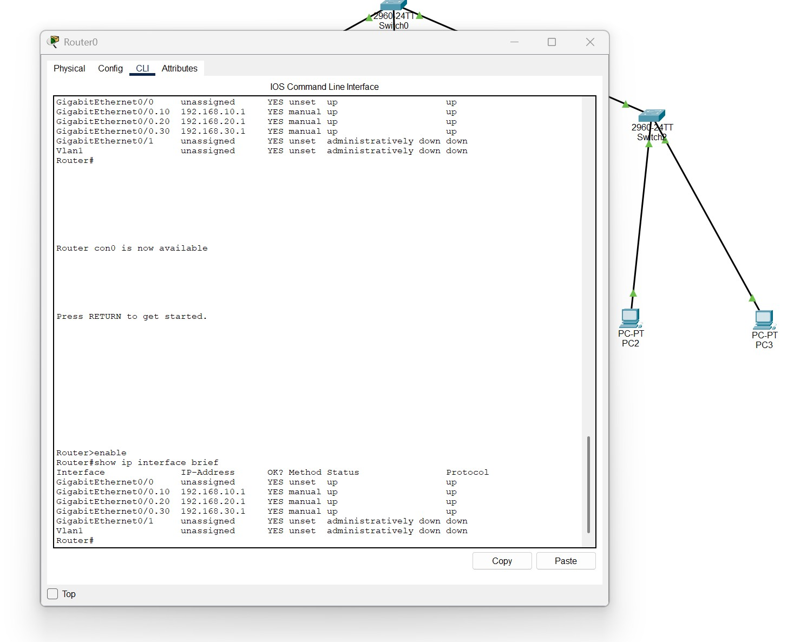
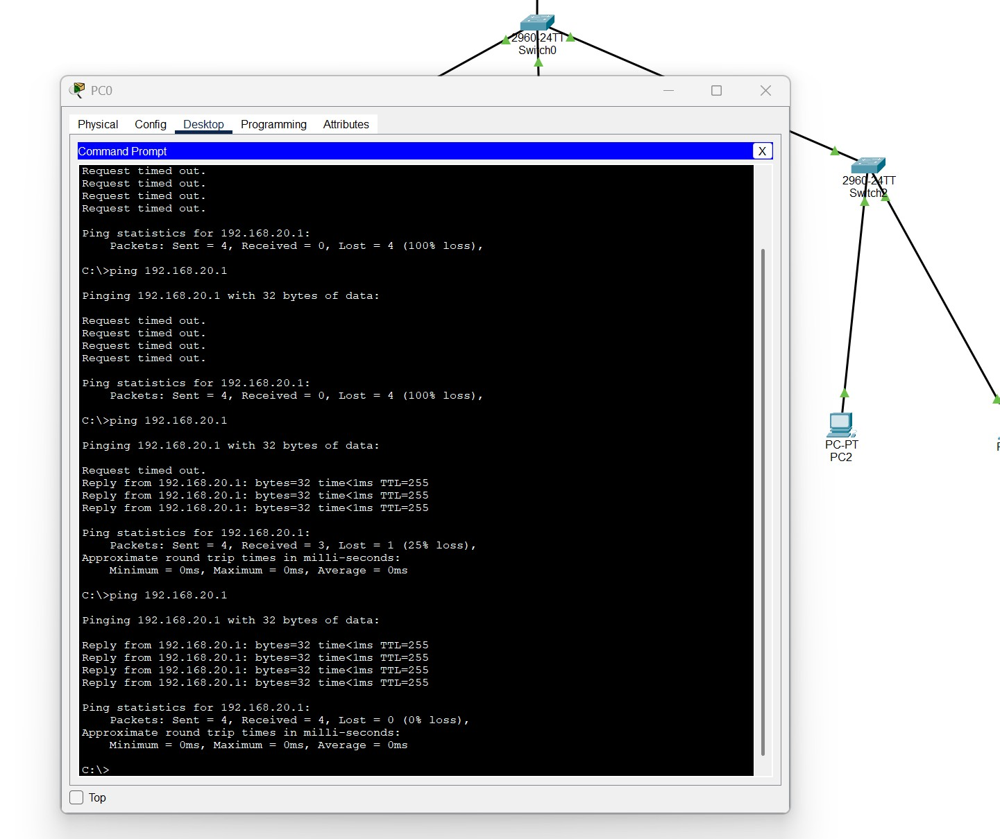
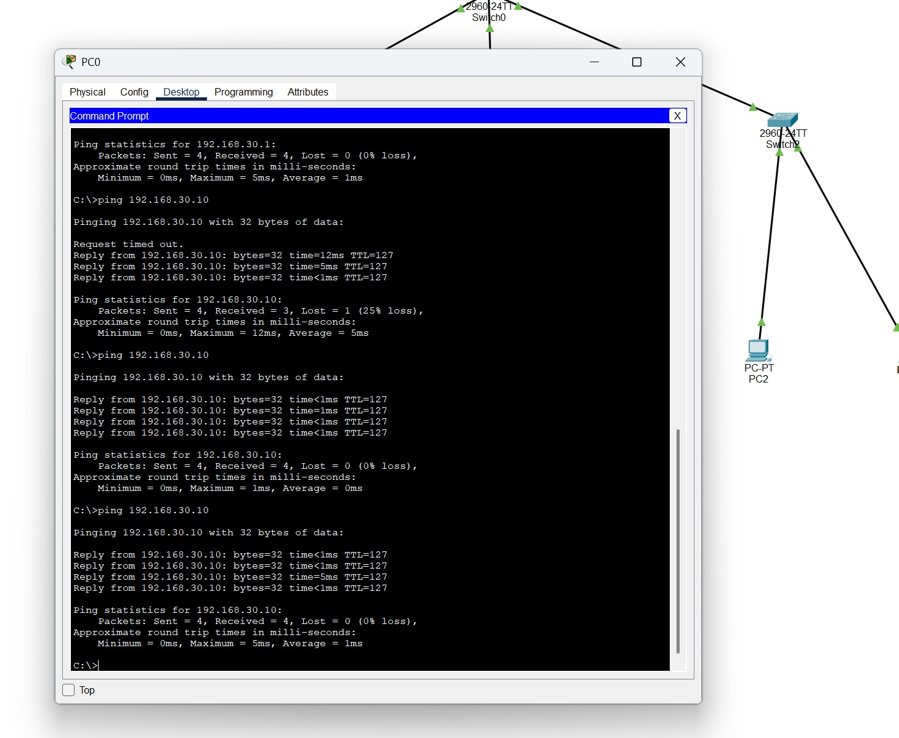

# School-Network-VLAN-Router-on-a-Stick
Cisco Packet Tracer project demonstrating VLAN segmentation, trunk links, and inter-VLAN routing using Router-on-a-Stick.

## Project Overview

This Cisco Packet Tracer project demonstrates VLAN segmentation, trunk configuration, and inter-VLAN routing using the Router-on-a-Stick method.

## Network Topology

## VLAN Configuration

## VLANs Used

| VLAN | Name |
|------|------|
| 10 | ADMIN |
| 20 | TEACHERS |
| 30 | STUDENTS |

## Teacher VLAN Port Assignment

## Student VLAN Port Assignment

## Trunk Configuration

## Router Subinterfaces

## Router-on-a-Stick VLAN Test

## Inter-VLAN Routing Test

## Skills Demonstrated

- VLAN Creation and Management
- Switch Port Assignment
- 802.1Q Trunk Configuration
- Router-on-a-Stick Configuration
- Inter-VLAN Routing
- Network Troubleshooting
- Connectivity Testing

## Technologies Used

- Cisco Packet Tracer
- Cisco Switches
- Cisco Router
- VLANs
- Trunking
- Inter-VLAN Routing

## Results

Successfully configured VLAN segmentation and verified communication between multiple VLANs through Router-on-a-Stick inter-VLAN routing.
